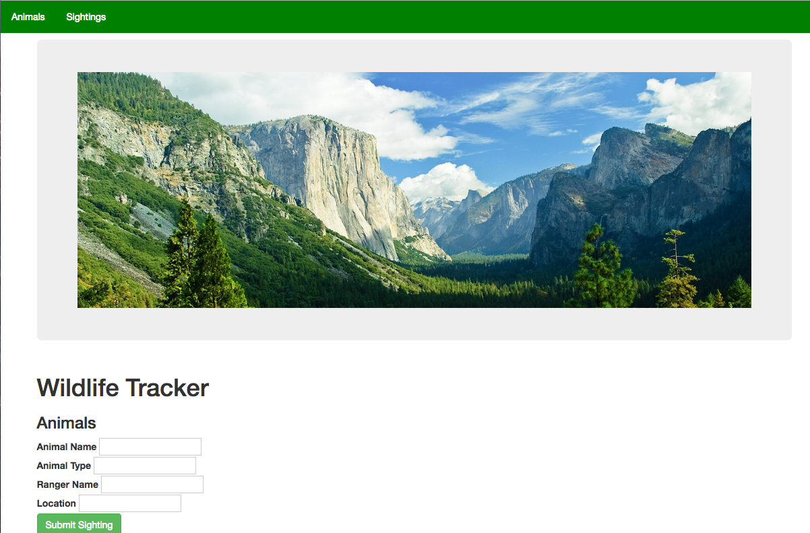

#   Wildlife Tracker
Version 0.0.0: September 26, 2016

by [Vanessa Palacios Sharma](https://github.com/VanessaSharma)

## Description
Wildlife tracker

### Specifications
#### User Stories:
The Forest Service is considering a proposal from a timber company to clearcut a nearby forest of Douglas Fir. Before this proposal may be approved, they must complete an environmental impact study. You have been asked to build an application that allows Rangers to track wildlife sightings in the area.

#### Database Diagram:

#### Technical Specifications:

## Setup/Installation
* Clone directory
* Setup database in PSQL:
  * CREATE DATABASE wildlife;
  * CREATE TABLE animals (id serial PRIMARY KEY, name varchar, health varchar, age varchar, type varchar);
  * CREATE TABLE sightings (id serial PRIMARY KEY, location varchar, rangerName varchar, animalId int, timeSighted timestamp);
* Type 'gradle run' inside the directory
* Navigate to 'http://localhost:4567'

## Support & Contact
For questions, concerns, or suggestions please email vanelunapalacios@live.com

## Known Issues
* N/A

## Technologies Used
Java, JUnit, Spark, PostgreSQL, Gradle

## Legal
*Licensed under the GNU General Public License v3.0*

Copyright (c) 2016 Copyright _Vanessa Palacios Sharma_ All Rights Reserved.
