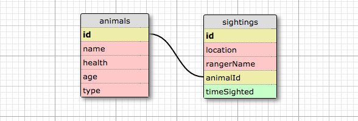

#   Wildlife Tracker
Version 0.0.0: September 26, 2016

by [Vanessa Palacios Sharma](https://github.com/VanessaSharma)

## Description
Wildlife tracker

### Specifications
#### User Stories:
The Forest Service is considering a proposal from a timber company to clearcut a nearby forest of Douglas Fir. Before this proposal may be approved, they must complete an environmental impact study. You have been asked to build an application that allows Rangers to track wildlife sightings in the area.

The application must track two categories of wildlife:

Animals

At the very least, require:

id
name
Endangered Animals

Due to their dwindling numbers, Rangers must record additional information about EndangeredAnimals:

id
name
health
Use constants to define options like "healthy", "ill", and "okay".
age (an estimated guess by the ranger)
Use constants to define options like "newborn", "young", or "adult".
Each time an animal species of either category is seen, a Sighting must be reported:

Sightings

When wildlife is spotted, a Ranger submits a form to record a Sighting containing the following:

id of Animal or EndangeredAnimal species
location
(Conveyed in any manner you choose ie: "Zone A", "Near the River", "NE Quadrant", or latitude and longitude values are all acceptable.)
rangerName
Exceptions

It may take a few days for new Rangers to familiarize themselves with the app. To avoid saving incomplete or invalid records, throw and catch exceptions if Rangers attempt to submit an incomplete form, or misuse the application in any other conceivable fashion.

#### Database Diagram:

#### Technical Specifications:

## Setup/Installation
* Clone directory
* Setup database in PSQL:
  * ...
* Type 'gradle run' inside the directory
* Navigate to 'http://localhost:4567'

## Support & Contact
For questions, concerns, or suggestions please email vanelunapalacios@live.com

## Known Issues
* N/A

## Technologies Used
Java, JUnit, Spark, PostgreSQL, Gradle

## Legal
*Licensed under the GNU General Public License v3.0*

Copyright (c) 2016 Copyright _Vanessa Palacios Sharma_ All Rights Reserved.
